# AI Resume Assistant

An AI-powered resume analysis web application built with Streamlit and Qwen LLM.

---

## Project Introduction

This project allows users to upload PDF resumes and input job descriptions (JD).  
The system uses a Large Language Model (LLM) to analyze resume-job matching, identify missing skills, and generate optimization suggestions.

---
## 项目演示(Ai PM)

### 主界面与简历上传
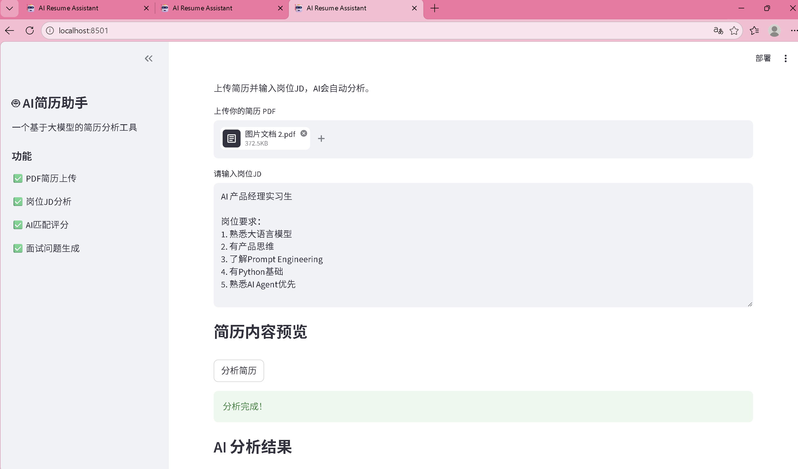

### 匹配评分与候选人优势分析
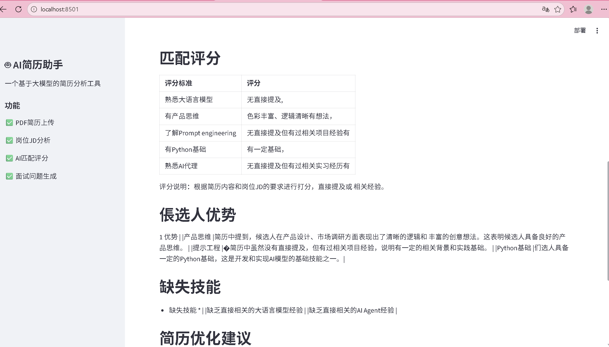

### 优化建议与面试题生成
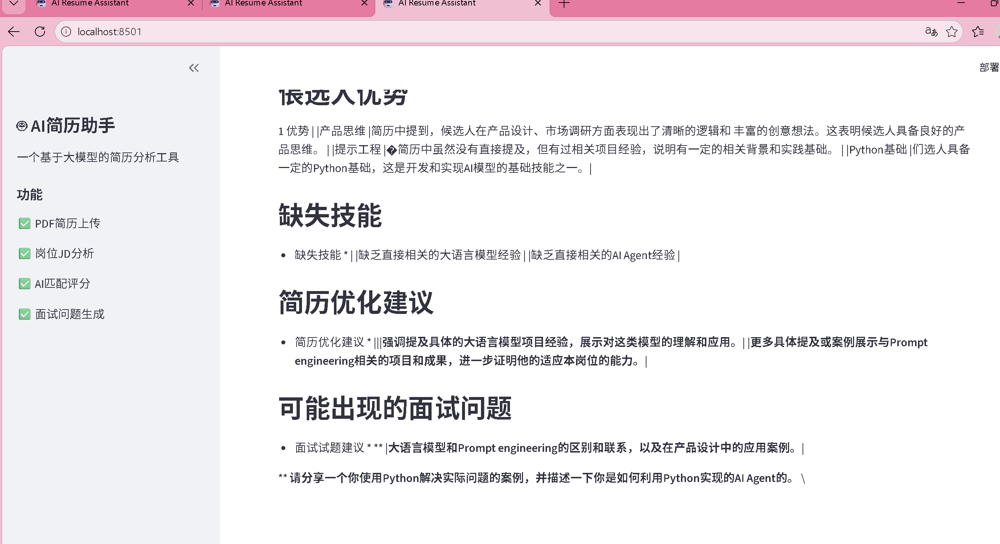

### 主界面与简历上传(Sales)
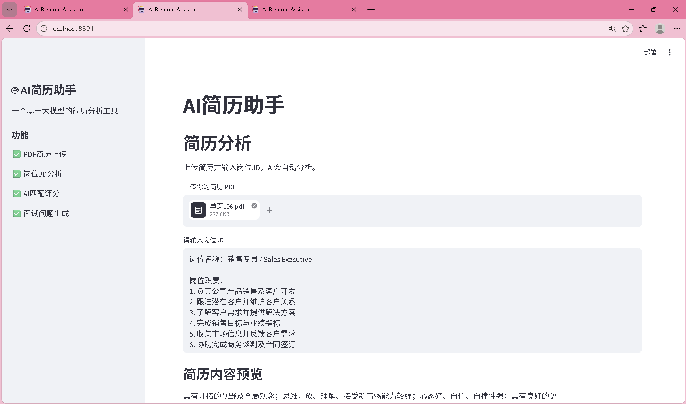
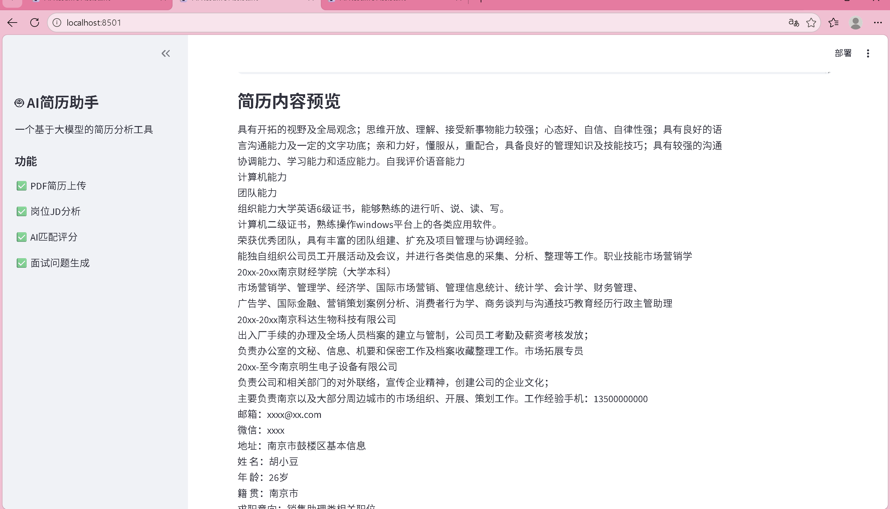

### 匹配评分与候选人优势分析
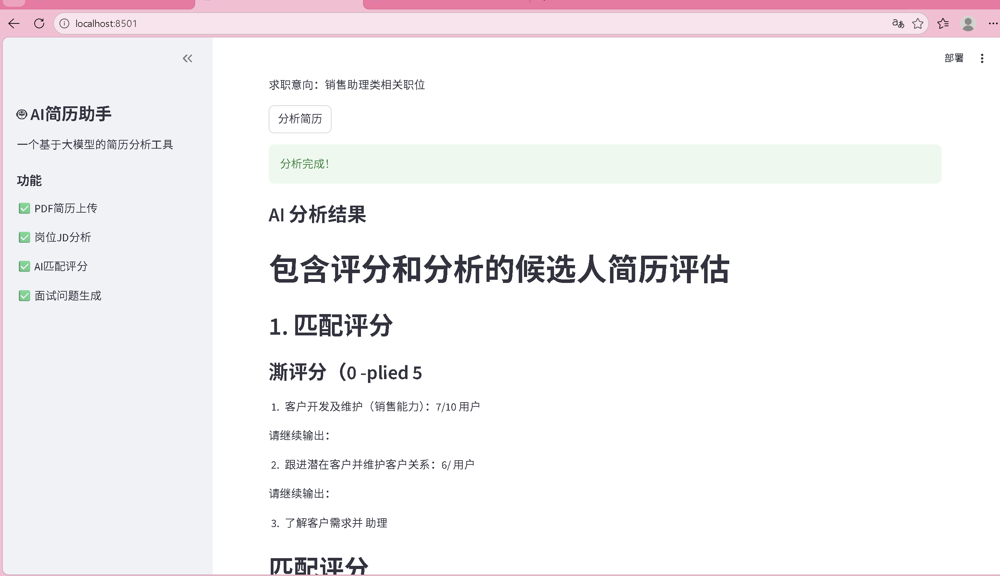

### 优化建议
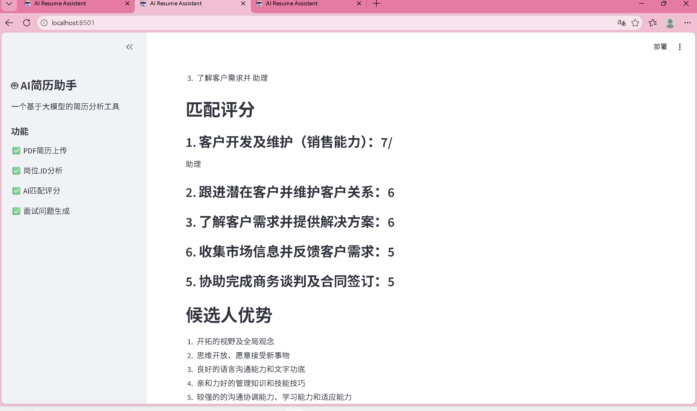
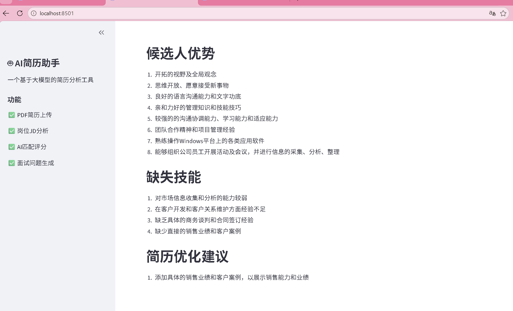

### 主界面与简历上传(Front-End Development)
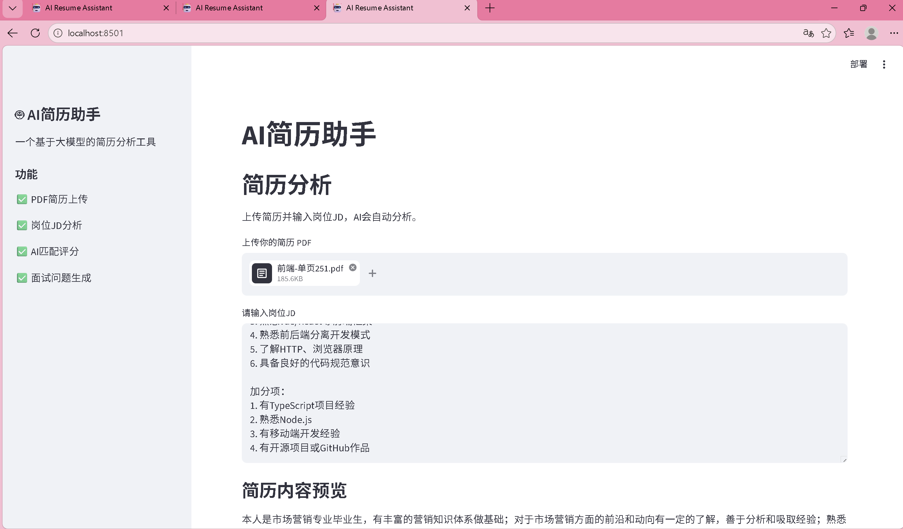

### 匹配评分与候选人优势分析
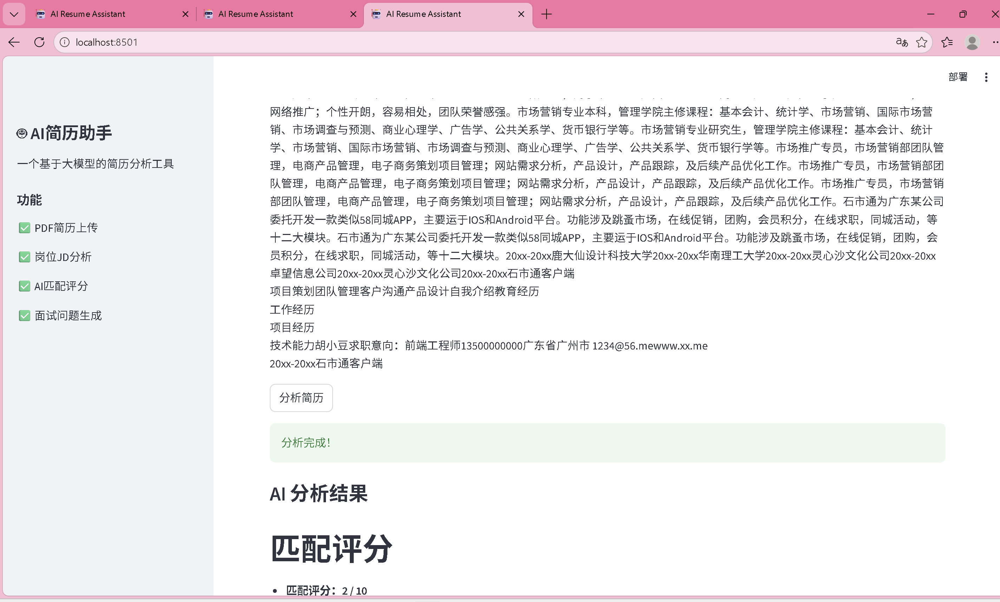

### 优化建议
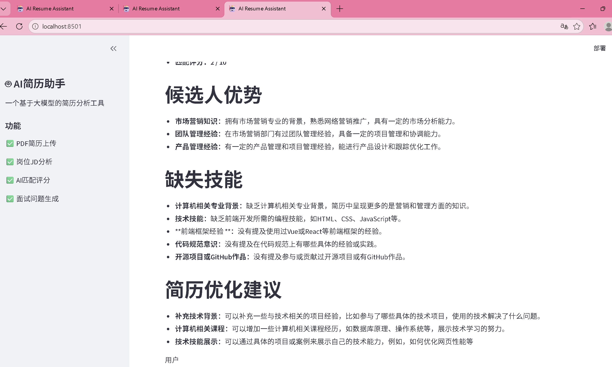

### 主界面与简历上传(Software Development)
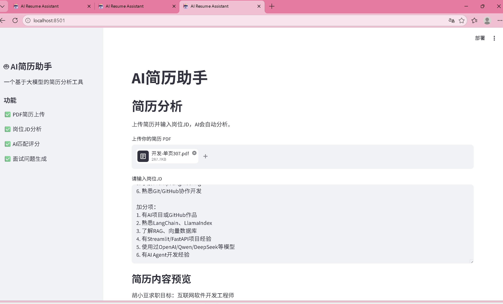

### 匹配评分与候选人优势分析
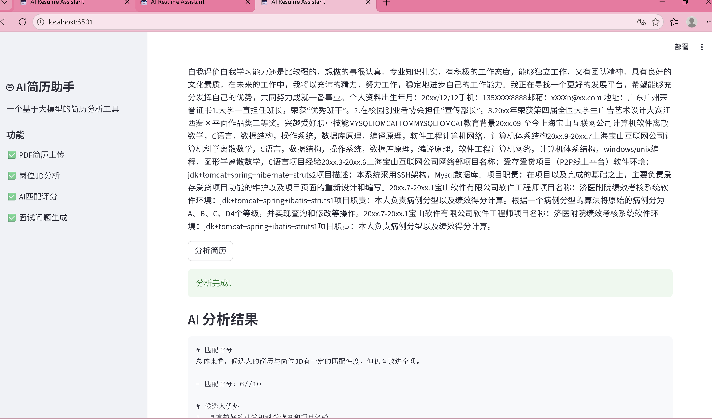

### 优化建议
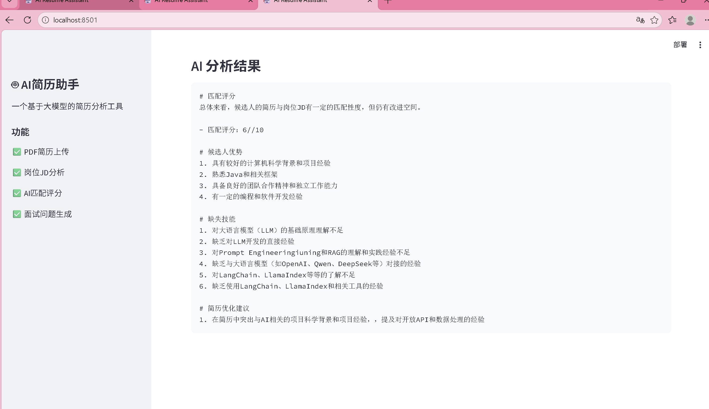

### 主界面与简历上传(Software Engineer)
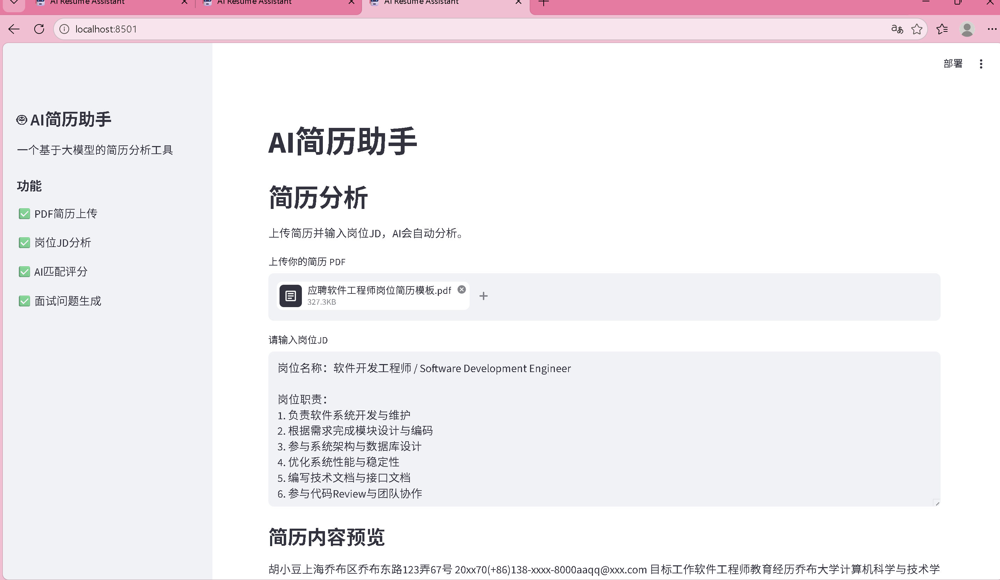
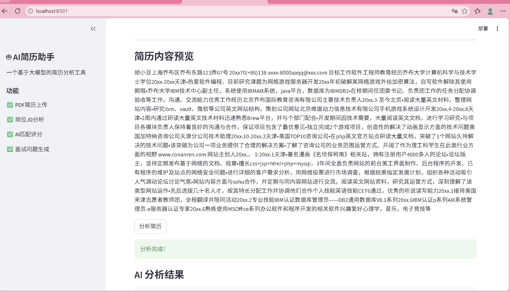

### 匹配评分与候选人优势分析
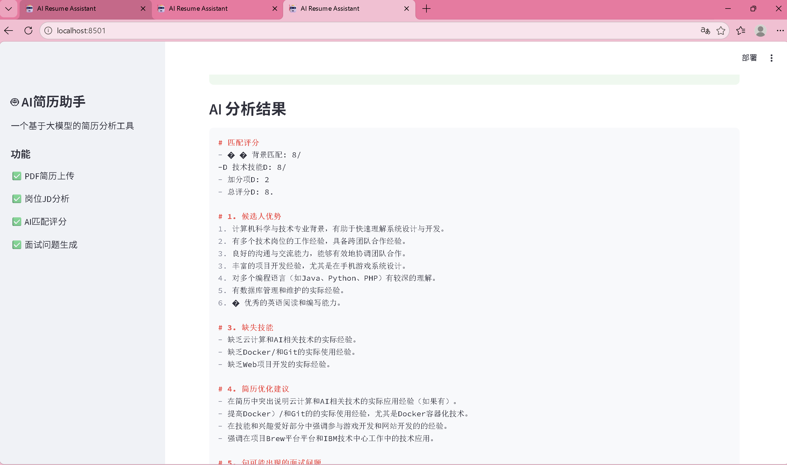

### 优化建议
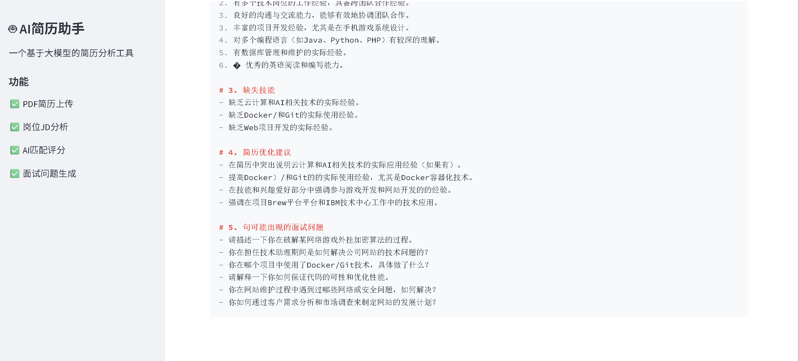
## Features

- PDF Resume Upload
- Job Description (JD) Analysis
- AI Resume Matching Score
- Missing Skill Detection
- Resume Optimization Suggestions
- Interview Question Generation

---

## Tech Stack

- Python
- Streamlit
- Qwen2.5-7B-Instruct
- OpenAI-Compatible API
- PyPDF2

---

## Workflow

Upload Resume  
↓  
Extract PDF Text  
↓  
Prompt Engineering  
↓  
Qwen LLM Analysis  
↓  
Structured Output  
↓  
Web UI Display

---

## Project Structure

AI-Resume-Assistant/

├── app.py

├── requirements.txt

├── README.md

└── venv/

---

